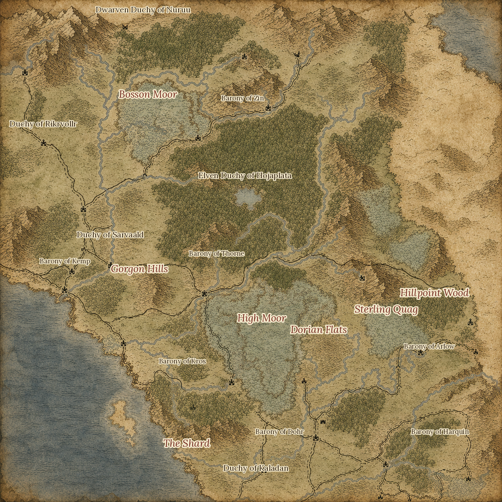
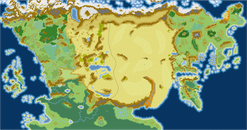

<div align="center">

# ✦ The Black Shard ✦

> *"On the Vestrn shore, the sea at your back and the sand a month away; this is the last land the Empire has not troubled to swallow."*


<br>



<sub><i>The Duchies of Vestrn.</i></sub>

<br><br>

*A worldbuilding archive of lore, history, peoples, languages, maps, and testimony.*

</div>

---

<div align="center">

**Jump to:**
[The West](#vestrn) · [The World](#weilan) · [The Looming East](#east) · [The Knot](#knot) · [Peoples](#peoples) · [Tongues](#tongues) · [The Calendar](#calendar) · [Philosophy](#philosophy) · [Repository](#repo) · [Canon](#canon) · [Roadmap](#roadmap)

</div>

---

## 🌍 The Black Shard

**The Black Shard** paracosm is a high fantasy world with a focus on political intrigue, linguistics, and anthropology.

Its stage is the continent of **Weilan**. On its western shore sits the shattered **Duchies of Vestrn**, a land of dukes and baronies, of dwarven mountains and elven wood, of a faith the Empire calls barbarous. On the eastern shore sits the core of the **Yavanna Empire**, from which the **Immortal Emperor Menneus** reigns over the continent. Yavanna is the weather on the eastern horizon: vast, ancient, deathless, and content to leave the west mostly alone... for now. Betwixt these great powers lied the **Great Desert of Wei**, TODO: finsh description of desert and wall

> *There is no "Black Shard" within the world. In-universe this is **Weilan**, and its western reach is **Vestrn**.*

This repository is Weilan's canonical archive. Though it is **not** a wiki of settled facts. Rather a **collection of testimonies**, primary sources that contradict one another, each written from inside some faith, court, or grievance. No single document is *the truth.* The truth is what survives being read against everything else.

---

<a id="vestrn"></a>

## 🛡 The Duchies of Vestrn

Long ago, there once was a **Kingdom** of Vestrn.

At the conclusion of the **Severance War** the kingdom was broken and forbidden to ever raise a king again. Thus, Vestrn was shattered into duchies and baronies, no duke permitted more than one. In exchange, the west was allowed to continue its way of life: its lords, its courts, its long memory, but not its faith, for the Severance outlawed many a god. The Empire watches from across the sand and, mostly, does not reach. **Mostly.**

<details>
<summary><b>🏰 The Duchies & Baronies</b></summary>

<br>

*Descriptions are stubs:*

| Realm | People | |
|---|---|---|
| [Duchy of Ríkrvollr](docs/nations/vestrn/rikrvollr.md) | Human | Northern reach; homeland of the Low Vestrn tongue |
| [Duchy of Sarvaald](docs/nations/vestrn/sarvaald.md) | Human | Heartland duchy; homeland of the Low Vestrn tongue |
| [Duchy of Kaladan](docs/nations/vestrn/kaladan.md) | Human | The southern duchy |
| [Dwarven Duchy of Nuruu](docs/nations/vestrn/nuruu.md) | Dwarven | The mountain halls; homeland of **Duegar** |
| [Elven Duchy of Hojaplata](docs/nations/vestrn/hojaplata.md) | Elven | The great wood; homeland of **Ojapól** |
| [The Baronies](docs/nations/vestrn/baronies.md) | Mixed | Zin · Kemp · Thorne · Kros · Arlow · Dohr · Harquin |

**Named lands & landmarks:** Bosson Moor · Gorgon Hills · High Moor · Dorian Flats · Sterling Quag · Hillpoint Wood · The Shard

📄 Full write-up planned at [`docs/geography/vestrn.md`](docs/geography/vestrn.md).

</details>

<details>
<summary><b>⚔️ The Faith of the West</b></summary>

<br>

The Duchies' old native faith is **Vanirism**, headed by **Lysara the War-Maiden**, who rode before the host and chose who would fall. The **Severance outlawed it**: her altars were thrown down and her name is now said low, or not at all. In its place the Empire raised **Aesirism** — a sanctioned "native" church whose priests bless the imperial months and teach that Lysara was a demon — so that the hand holding the west down wears a Vestrn face. Above both stands imperial **Eutaxia** and its calendar.

*(The imperial tale of a "rainbow-shouldered" god muddling Firēs and Phira is an outsider's misreading of the frontier, not the Vanir faith.)* See [`docs/religions/vestrn-faith.md`](docs/religions/vestrn-faith.md).

</details>

---

<a id="weilan"></a>

## 🗺 The World — the Continent of Weilan

One continent, cut in two by the **Great Desert of Wei** — the desert that gives Weilan its name.

<div align="center">

<br><sub><i>Vestrn holds the western shore; the Empire lies east, across the sand.</i></sub>
</div>

Down the spine of the desert stands **the Wall** — an ancient metal barrier half a kilometre high, its pistons still hissing and its turbines still turning, though what it was built to do has been forgotten. Whatever its purpose once was, it now does one thing: it gives water to **Myridian**, the **vertical city** of stacked layers and mechanical plateaus that climbs the Wall itself. Myridian is the **gate** between west and east — the **city of secrets**, and the first place a traveller out of Vestrn truly meets the granite of the Empire's reach.

```text
      WEST                THE GREAT DESERT OF WEI                EAST
        home                        ┃                          the shadow
 ┌──────────────┐        ┏━━━━━━━━━━╋━━━━━━━━━━┓        ┌───────────────────┐
 │  Duchies of  │        ┃      THE   WALL     ┃        │  Yona — the core  │
 │    Vestrn    │◀──────▶┃   ▓▓  MYRIDIAN  ▓▓  ┃◀──────▶│  Dora — the north │
 │ (left alone) │        ┃  the vertical gate  ┃        │   YAVANNA EMPIRE  │
 └──────────────┘        ┗━━━━━━━━━━╋━━━━━━━━━━┛        └───────────────────┘
                          pistons · turbines · water · secrets
```

📄 Planned: [`docs/geography/weilan.md`](docs/geography/weilan.md) · [`docs/technology/the-wall.md`](docs/technology/the-wall.md)

---

<a id="east"></a>

## 🌑 Yavanna & the Immortal Emperor

Looming from the east is the mighty Yavanna Empire.

<details>
<summary><b>⚖ Eutaxia & the Seven Who Hold the Days</b></summary>

<br>

The Empire's faith is **Eutaxia** (*good order*), whose gods are the **Hebdomad**, the **Seven who hold the days** of the week. To hold a day *is* to be a god; a god without a day is no god at all.

| Day | God | Domains |
|---|---|---|
| Monda | **Monas** | The Great Moon, solitude, asceticism, the cosmos |
| Tuesda | **Theureus** | Authority, sovereignty, caste, just war |
| Wirsda | **Firēs** | Wind, breath, sky, fate, travelers, messages |
| Horda | **Barjas** | Judgment, storms, the thunderbolt, trials |
| Frida | **Phira** | Love, marriage, fertility, union, sacred oaths |
| Sorda | **Sophras** | Wisdom, philosophy, the arcane arts, time, prophecy |
| Sunda | **Sounia** | The sun, fire, illumination, cosmic order |

*Once the Seven were **Eight**. The eighth would not keep her station.* See [`docs/religions/eutaxia.md`](docs/religions/eutaxia.md) — **drafted**.

</details>

<details>
<summary><b>♾ Menneus, the Immortal Emperor</b></summary>

<br>

**Menneus** the **Chakravartin** has reigned for over **eight hundred years** and has never died. He is not worshipped for he holds no day, and so by the faith's own rule he is not a god. However, he is **venerated** as the second power in heaven and earth, the hand that made the earth resemble the heavens.

He effectively controls all of Weilan: by direct rule in the east, by soft power and long shadow in the west. His grip is vast. It is also *brittle*, for a reason the whole world half-knows and no one can act upon. *(See [The Knot](#knot).)*

</details>

<details>
<summary><b>📿 The Reckoners</b> - the heresy of the abacus</summary>

<br>

A hunted cult who keep a forbidden book, the **Ledger**, and compute a feast no almanac can hold. They cannot be found by watching the calendar; an inquisitor must first learn to compute the very thing the Empire abolished. Numerate to a soul: *a cell that loses its abacus loses its faith within the year.*

</details>

---

<a id="knot"></a>

## 🪢 The Knot

Everything above ties into a single thread, the thing that makes the west's quiet resentment more than idle:

> **Menneus does not merely keep time. He is kept *by* it.**
>
> In the Severance he struck the **eighth day** from the calendar and bound his own deathlessness to the calendar he remade. His life and the year are one document. **Undo the Severance, and the Emperor falls** and Yavanna's grip on its satellites loosens with him.
>
> It cannot be done by winning a war. To defeat Menneus is to defeat **the one who holds time at bay.**

<details>
<summary><b>🌩 The Vestrn Prophecy</b></summary>

<br>

The Duchies hold that the Empire will fall upon a **Plerosis**, one of the four godless days that close the imperial year, should it coincide with a **great storm**. The Empire's own reckoners have computed that the moons' conjunction *does* fall within those four days four times in every Great Cycle, once on each day, at intervals of eighty-nine years, and they dismiss the prophecy as an oracle that arrives on a knowable date and then demands an unknowable sign.

The west keeps waiting. Storms, after all, belong to a god of **judgment**. Planned: [`docs/religions/eutaxia.md#the-vestrn-prophecy`](docs/religions/eutaxia.md).

</details>

---

<a id="peoples"></a>

## 👥 Peoples & 🗣 Tongues

<details>
<summary><b>👥 The Kindreds of the West</b></summary>

<br>

Vestrn is not one people. Its human duchies share the west with two older kindreds:

- 🧔 **Dwarves** — the mountain halls of the **Duchy of Nuruu**, who speak **Duegar**. → [`docs/peoples/dwarves.md`](docs/peoples/dwarves.md)
- 🏹 **Elves** — the great wood of the **Duchy of Hojaplata**, who speak **Ojapól**. → [`docs/peoples/elves.md`](docs/peoples/elves.md)
- 👤 **Humans** — the Vestrn duchies and baronies, speaking **High** and **Low Vestrn**.

</details>

<a id="tongues"></a>

<details>
<summary><b>🗣 The Languages</b></summary>

<br>

Each recorded tongue is shaped after a real-world language — and because those originals belong to real families, the analogs already encode a **shared ancestry and a migration history.**

| In-world | Homeland | Modeled on | Family |
|---|---|---|---|
| **High Vestrn** | Hojland | Dutch | Vestrenic *(West Germanic)* |
| **Low Vestrn** | Sarvaald / Ríkrvollr | English | Vestrenic *(West Germanic)* |
| **Duegar** | Nuruu | German | Vestrenic *(West Germanic)* — the dwarves |
| **Ojapól** | Hojaplata | Spanish | Silver *(Romance)* — the elves |
| **D'gento** | Valle d'argento | Italian | Silver *(Romance)* |
| **Hskan** | Hanzith | Armenian | Hskan *(its own branch)* |
| **Havari** | Havaari | Bulgarian | Havaric *(Slavic)* |
| **Bahari** | Albahaar | Romani | Indic *(diaspora)* |
| **Yona** | Southern Yavanna | Greek | Yonic *(Hellenic)* — the imperial core |
| **Doran** | Northern Yavanna | Turkish | *— outside the family* |
| **Myridic** | Myridian | Arabic | *— outside the family* |

```text
⟨ Urspeech ⟩  (proposed common ancestor)
├─ Vestrenic (Germanic) ── High Vestrn · Low Vestrn · Duegar
├─ Argentic  (Romance)  ── Ojapól · D'gento
├─ Yonic     (Hellenic) ── Yona          ← the Empire's vernacular & liturgy
├─ Hskan     (own branch)─ Hskan
├─ Havaric   (Slavic)   ── Havari
└─ Indic     (Indo-Aryan)─ Old Indic (Yavanna's sacred words) · Bahari (the wanderers)

Beyond the family:
    Doran   · Turkish   ← steppe migrants, now the north of Yavanna (Dora)
    Myridic · Arabic    ← Myridian, the gate-city of the Wall
```

The two **outsider** tongues rode in from beyond the family; the rest are cousins. Note that the Empire's deepest sacred words descend from **Old Indic** (*súrya → Sounia*, *vajra → Barjas*), a dead language whose only living cousin still walks the roads as **Bahari**, the wanderers. Data lives in [`docs/languages/languages_of_weilan.csv`](docs/languages/languages_of_weilan.csv): **drafted**.

</details>

---

<a id="calendar"></a>

## 🗓 The Calendar

<details>
<summary><b>The Eutaxian year</b> - 361 days, nineteen months, seven gods</summary>

<br>

The imperial year is **361 days, a perfect square, 19², kept as nineteen months of nineteen days.** Its **seven-day week** is named for the Seven and begins on Monda. Where week and year fail to divide, four godless days, the **Plerosis**, close the year outside the week entirely, and it is on those four days that Vestrn's prophecy waits.

Full write-up: [`docs/cosmology/eutaxian-calendar.md`](docs/cosmology/eutaxian-calendar.md) — **drafted**.

</details>

---

<a id="philosophy"></a>

## ✨ Core Philosophy

> This is not a story.
>
> It is a **world**, and stories only pass through it.
>
> Every duchy has a grievance. Every faith has a heresy. Every map has a lie on it somewhere.
>
> Every source here has an author, and every author has a reason to shade the truth. The record does not agree with itself. 

> The goal is *verisimilitude*, meaning the believability of the world.

---

<a id="repo"></a>

## 📂 Repository Structure

```text
.
├── docs/
│   ├── geography/
│   │   ├── weilan.md                 ← planned   (the continent, the Wei, the Wall)
│   │   └── vestrn.md                 ← planned   (the western reach)
│   ├── nations/
│   │   ├── vestrn/
│   │   │   ├── rikrvollr.md          ← stub
│   │   │   ├── sarvaald.md           ← stub
│   │   │   ├── kaladan.md            ← stub
│   │   │   ├── nuruu.md              ← stub     (Dwarven Duchy)
│   │   │   ├── hojaplata.md          ← stub     (Elven Duchy)
│   │   │   └── baronies.md           ← stub     (Zin, Kemp, Thorne, Kros, Arlow, Dohr, Harquin)
│   │   └── yavanna/
│   │       └── the-empire.md         ← planned
│   ├── religions/
│   │   ├── eutaxia.md                ← drafted
│   │   ├── vestrn-faith.md           ← planned
│   │   └── sideria.md                ← drafted  (Sylvan star-cult, D'gento voice)
│   ├── history/
│   │   └── severance.md              ← planned
│   ├── peoples/
│   │   ├── dwarves.md                ← stub
│   │   └── elves.md                  ← stub
│   ├── languages/
│   │   └── languages_of_weilan.csv   ← drafted
│   ├── cosmology/
│   │   └── eutaxian-calendar.md      ← drafted
│   ├── cultures/
│   ├── technology/
│   │   └── the-wall.md               ← stub    (the Wall)
│   ├── timelines/
│   ├── characters/
│   └── stories/
│
├── maps/
│   ├── vestrn-labeled-fancy.png      ★ the west, illustrated & labelled
│   ├── vestrn.png                      illustrated, unlabelled
│   ├── vestrn-labeled.png              hex reference (labelled)
│   └── weilan-overview.png             the continent (context)
│
├── assets/
│   ├── artwork/
│   ├── flags/
│   └── symbols/
│
├── _authoring/                       ← drafting notes and info searching a home
│   ├── WIKI_SCHEMA.md
│   ├── SCRATCHPAD_eutaxia.md
│   ├── SCRATCHPAD_sideria.md
│   └── SCRATCHPAD_vestrn.md
│
└── README.md
```

<details>
<summary><b>📚 What each <code>docs/</code> folder holds</b></summary>

<br>

| Folder | Holds |
|---|---|
| `cosmology/` | The heavens, the Two Orders, the moons, the shape of creation |
| `geography/` | Weilan: the Wei, the Wall, Vestrn, the regions and cities |
| `history/` | Major events: Unification, the Severance, the present unquiet |
| `timelines/` | Dated chronologies drawn from the histories |
| `nations/` | The Duchies of Vestrn and the Yavanna Empire: rule, borders, courts |
| `religions/` | Eutaxia, the western faith, and the heresies between |
| `peoples/` | The kindreds of Weilan: human, dwarven, elven |
| `cultures/` | Custom, caste, rite, and daily life |
| `languages/` | Tongues, scripts, and their family history |
| `technology/` | Craft and machinery: the Wall foremost among its mysteries |
| `characters/` | Figures who move the world, living and deathless |
| `stories/` | Fiction set inside the world: tales, scenes, campaigns |

</details>

---

<a id="canon"></a>

## 🧭 Canon & Testimony

The archive tracks **two separate things**, and keeps them apart on purpose.

<table>
<tr><th>Canon status — <i>is it settled?</i></th><th>Source reliability — <i>can this narrator be trusted?</i></th></tr>
<tr><td valign="top">

| | |
|---|---|
| ✅ Canon | Official lore |
| 🟨 Draft | Being developed |
| 🟪 Experimental | May change drastically |
| ❌ Deprecated | No longer canon |

</td><td valign="top">

Every in-world source carries frontmatter:
`source` · `perspective` · `reliability` · `status`

A document can be **✅ canon** and  **untrue**.

</td></tr>
</table>

---

## 📖 World Statistics

```text
Imperial Year        :: 812
Continent            :: Weilan
The west             :: The Duchies of Vestrn
The east             :: Yavanna Empire: Yona · Dora  (the east)
Peoples              :: Human · Dwarven · Elven
Landmark             :: The Wall: ancient, ~500m, purpose forgotten
Gate-City            :: Myridian: the vertical city of secrets
Languages Recorded   :: 11
Moons                :: 2: Luna Mayr & Luna Sora   (the Empire: Monē & Mania)
Emperor              :: 1, immortal, 800+ years reigning
```

---

<a id="roadmap"></a>

## 🌌 Current Scope & Roadmap

**Have:**
- [x] Core geography (Weilan, the Wei, the Wall, Myridian)
- [x] The map of Vestrn
- [x] A major faith (Eutaxia) & its calendar
- [x] Foundational languages
- [x] The central premise (the Knot)

**Next:**
- [ ] Vestrn nation articles (duchies, baronies, faiths, etc.)
- [ ] The western faith (Firēs–Phira fusion)
- [ ] Peoples: dwarves of Nuruu, elves of Hojaplata
- [ ] `severance.md` the war, the terms, the reckoning
- [ ] Historical timeline (Unification → Severance → present)
- [ ] Cosmology & the shape of the heavens
- [ ] Name the remaining sixteen months & settle the moons
- [ ] Interactive atlas & searchable wiki

---

<details>
<summary><b>🗺 The Maps</b></summary>

<br>

| File | What it is |
|---|---|
| `maps/vestrn-labeled-fancy.png` | The illustrated Vestrn map, labelled |
| `maps/vestrn.png` | The same illustration, unlabelled |
| `maps/vestrn-labeled.png` | The hex working map, fully labelled (reference) |
| `maps/weilan-overview.png` | The whole continent, for context |

</details>

---

<details>
<summary><b>🌠 Lore Teaser</b></summary>

<br>

Once, the week had eight days.

One of them was struck from the calendar, and the goddess who held it was struck from the sky. She has been running ever since, seven nights out and seven nights home, over the heads of a people who cast her down and then, out of pity, kept giving her a day. An Emperor took even that away, and in taking it, took his own death out of the world.

Now he cannot die, and the west cannot rise, and both facts have the same cause.

The Empire calls this **order.** The Duchies call it **the weather**, and await a storm.

</details>

---

<div align="center">

### *"Every civilization believes it is standing at the end of history.*
### *None of them were right."*

</div>
